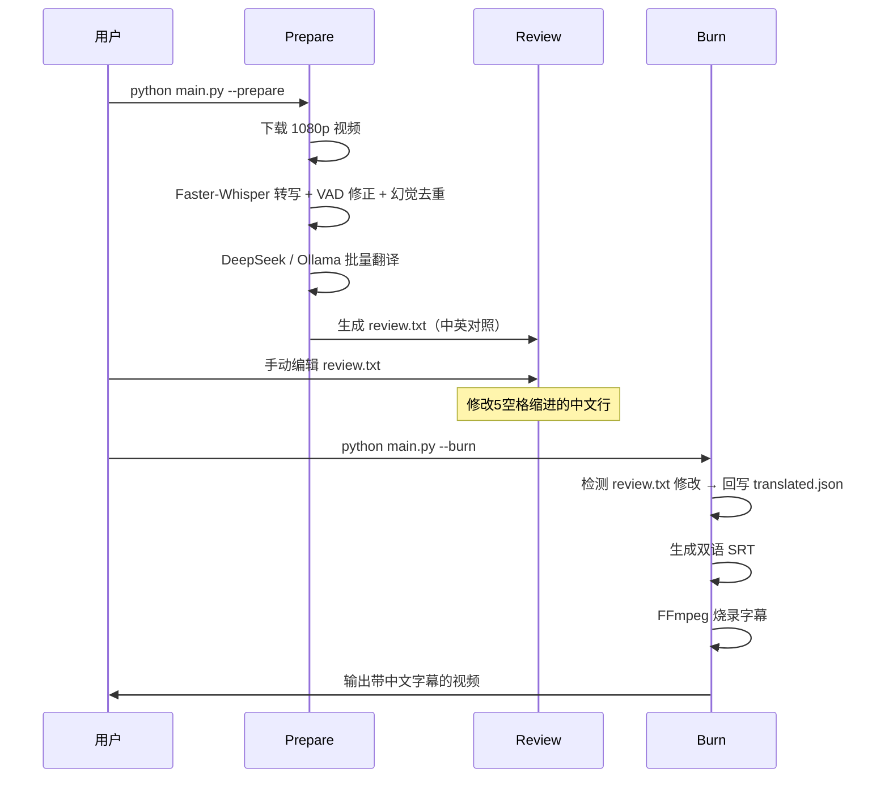

<div align="center">

# VlogTrans

**YouTube Vlog 自动汉化工具**

从频道监控到字幕烧录的全流程自动化

[](https://python.org)
[](https://github.com/SYSTRAN/faster-whisper)
[](https://api.deepseek.com)
[](https://ollama.com)

</div>

---

## ✨ 特性

- 🎬 **全流程自动化** — 频道监控 → 1080p 下载 → 语音转写 → 翻译 → 字幕烧录
- 🔍 **两阶段架构** — Prepare（准备）+ Burn（烧录），支持中间审查与编辑
- 🤖 **多后端翻译** — DeepSeek API（主）→ Ollama Qwen2.5（回退），自动 fallback，数据安全有保障
- 🎯 **VAD 时间修正** — Silero VAD 修正 Whisper 时间戳偏移，解决 BGM 段字幕提前问题
- 🧹 **幻觉去重** — 自动检测并删除 Whisper 重复幻觉段
- 📝 **翻译审查** — 中英对照 review.txt，编辑后自动回写缓存
- 📡 **多频道支持** — 同时监控多个 YouTube 频道，自动去重
- 🔗 **单视频处理** — `--video` 参数直接处理任意视频 URL
- 🖥️ **可视化面板** — Streamlit Web UI，配置检查、任务运行、翻译审查一站搞定

---

## 🏗️ 架构


---

## 🛠️ 技术栈

| 类别 | 技术 | 用途 |
|------|------|------|
| 语言 | Python 3.10+ | 主程序 |
| 语音转写 | [Faster-Whisper](https://github.com/SYSTRAN/faster-whisper) | CTranslate2 加速英文语音识别 |
| 翻译引擎 | [DeepSeek](https://api.deepseek.com) + [Ollama](https://ollama.com) (Qwen2.5) | 双后端 fallback 翻译 |
| 视频下载 | [yt-dlp](https://github.com/yt-dlp/yt-dlp) | YouTube 视频下载 |
| 语音检测 | [Silero VAD](https://github.com/snakers4/silero-vad) | 语音活动检测，修正时间戳 |
| 字幕烧录 | [FFmpeg](https://ffmpeg.org) | ASS 字幕渲染 + 视频编码 |
| 配置管理 | python-dotenv | 环境变量加载 |

---

## 📦 安装

### 前置依赖

1. **Python 3.10+**
2. **FFmpeg** — [下载地址](https://www.gyan.dev/ffmpeg/builds/)
3. **Ollama** — [下载地址](https://ollama.com/download)
4. **yt-dlp** — `pip install yt-dlp` 或 [下载 exe](https://github.com/yt-dlp/yt-dlp/releases)

### 步骤

```bash
# 1. 克隆仓库
git clone https://github.com/YOUR_USERNAME/VlogTrans.git
cd VlogTrans

# 2. 创建虚拟环境
python -m venv .venv

# Windows
.venv\Scripts\activate

# macOS / Linux
source .venv/bin/activate

# 3. 安装依赖
pip install -r requirements.txt
pip install torch  # Silero VAD 所需
# Faster-Whisper 模型首次运行时自动下载（约 1.5GB）
# 国内用户可在 .env 中设置 HF_ENDPOINT=https://hf-mirror.com 加速下载

# 4. 安装 Ollama 翻译模型
ollama pull qwen2.5

# 5. 配置环境变量
cp .env.example .env
# 编辑 .env，填入你的配置

# 6. 准备 YouTube Cookies（下载 1080p 需要）
# 优先方案：安装 Firefox 浏览器，yt-dlp 会自动读取 cookies，无需手动配置
# 回退方案：使用浏览器插件导出 cookies 为 Netscape 格式，保存为 www.youtube.com_cookies.txt
# 在 .env 中设置 YOUTUBE_COOKIES_PATH 指向该文件
```

---

## ⚙️ 配置

编辑 `.env` 文件进行配置：

| 配置项 | 必填 | 说明 | 示例 |
|--------|:----:|------|------|
| `YOUTUBE_CHANNEL_URLS` | ✅ | 监控的频道 URL（逗号分隔） | `https://youtube.com/@sydneyserena,https://youtube.com/@leahhalton` |
| `FFMPEG_PATH` | ✅ | FFmpeg 可执行文件路径 | `D:\ffmpeg\bin\ffmpeg.exe` |
| `YT_DLP_PATH` | ✅ | yt-dlp 路径 | `D:\yt-dlp.exe` |
| `TRANSLATION_BACKEND` | | 翻译后端（`deepseek` / `ollama`） | `deepseek` |
| `TRANSLATION_BACKENDS_ORDER` | | 后端 fallback 链（逗号分隔，前者优先） | `deepseek,ollama` |
| `DEEPSEEK_API_KEY` | | DeepSeek API Key | `sk-xxx` |
| `DEEPSEEK_MODEL` | | DeepSeek 模型 | `deepseek-chat` |
| `TRANSLATION_MODEL` | | Ollama 翻译模型 | `qwen2.5` |
| `WHISPER_MODEL` | | Faster-Whisper 模型 | `medium.en` |
| `HF_ENDPOINT` | | HuggingFace 镜像（国内加速模型下载） | `https://hf-mirror.com` |
| `YOUTUBE_COOKIES_PATH` | | Cookies 文件路径（Firefox 用户可跳过，自动从浏览器读取） | `www.youtube.com_cookies.txt` |
| `OLLAMA_HOST` | | Ollama 服务地址 | `http://127.0.0.1:11434` |
| `OLLAMA_DISABLE_PROXY` | | 禁用 Ollama 代理 | `true` |
| `HTTP_PROXY` | | HTTP 代理 | `http://127.0.0.1:7897` |
| `HTTPS_PROXY` | | HTTPS 代理 | `http://127.0.0.1:7897` |

---

## 🚀 使用

### 基本流程

```bash
# Step 1: 准备阶段 — 下载视频 + 转写 + 翻译
python main.py --prepare

# Step 2: 审查翻译 — 编辑 data/cache/<video_id>/review.txt
#          修改中文翻译行（5空格缩进的行）

# Step 3: 烧录阶段 — 生成字幕 + 烧录到视频
python main.py --burn
```

### CLI 参数

| 参数 | 说明 |
|------|------|
| `--prepare` | 准备阶段：下载视频 → Faster-Whisper 转写 → VAD 修正 → 幻觉去重 → 翻译 → 生成 review.txt |
| `--burn` | 烧录阶段：回写 review.txt 修改 → 生成 SRT → FFmpeg 烧录字幕 |
| `--all` | 一键运行：prepare + burn，跳过审查 |
| `--video URL` | 处理单个视频 URL |

### 示例

```bash
# 监控频道，自动处理最新视频
python main.py --prepare

# 处理单个视频
python main.py --video https://youtu.be/dQw4w9WgXcQ

# 一键完成（跳过审查）
python main.py --all

# 审查后烧录
python main.py --burn
```

---

## 📂 项目结构

```
VlogTrans/
├── main.py                          # 主入口，CLI 参数解析与流程编排
├── app.py                           # Streamlit 可视化操作面板
├── config.py                        # 配置加载（.env → Settings）
├── .env.example                     # 配置模板
├── requirements.txt                 # Python 依赖
├── modules/
│   ├── radar/
│   │   └── radar.py                 # YouTube 频道监控与视频下载
│   ├── translator/
│   │   ├── translator.py            # 翻译调度（批量翻译 + 后端链）
│   │   └── backends/
│   │       ├── deepseek_backend.py  # DeepSeek API 翻译后端
│   │       └── ollama_backend.py    # Ollama 本地翻译后端
│   ├── merger/
│   │   └── merger.py                # FFmpeg 字幕烧录
│   ├── audit/
│   │   └── audit.py                 # 审计模块
│   ├── ui_helpers.py                # Streamlit 面板辅助函数
│   └── storage.py                   # 视频处理状态持久化
├── data/                            # 运行时数据（gitignore）
│   ├── videos/                      # 下载的原始视频
│   ├── subtitles/                   # 生成的 SRT 字幕
│   ├── cache/                       # 缓存（segments / translated / meta）
│   └── output/                      # 烧录后的输出视频
└── tests/                           # 单元测试
```

---

## 🔄 工作流程



### 缓存机制

| 缓存文件 | 内容 | 失效条件 |
|----------|------|----------|
| `meta.json` | 视频标题 | 手动删除 |
| `segments.json` | Faster-Whisper 转写结果 | `WHISPER_MODEL` 变更 |
| `translated.json` | 翻译结果 | `TRANSLATION_MODEL` 或 `batch_size` 变更 |
| `review.txt` | 中英对照审查文件 | 手动编辑 |

---

## ⚠️ 已知限制

| 限制 | 说明 |
|------|------|
| 翻译串位 | Faster-Whisper 按时间切片分段，长句可能被拆开导致翻译串位，需手动审查 |
| Cookies 有效期 | Firefox cookies 自动读取，无需手动导出；若使用 cookies 文件，几小时后过期需重新导出 |
| CPU 转写速度 | medium.en 模型在 CPU 上约 5 分钟/15 分钟视频（Faster-Whisper CTranslate2 加速） |
| 仅支持英文 | 当前仅支持英文转写 + 中译，其他语言需调整 Faster-Whisper 模型和翻译 prompt |

---

## 📄 License

MIT License
